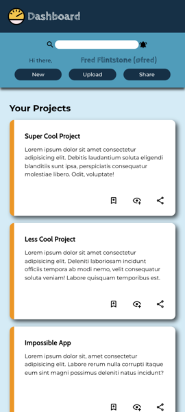
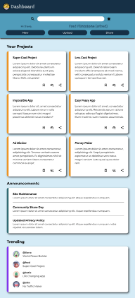
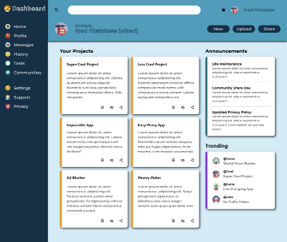

# Mock Admin Dashboard Page
## Admin Dashboard project for the [The Odin Project](https://www.theodinproject.com/)

## Overview

This is a mock admin dashboard page which has three sections: Header, Sidebar and Main. The page is designed in the way of Holy Grid Layout almost entirely using CSS Grid.

The left sidebar takes up the whole height of the page. It has all navigation links. Header occupies top of the page and it's position is fixed. It has a search bar, user's name and some buttons. Main takes up the rest of the page. This is further divided into two sections, the left one is for the projects and the right one is made up of 2 small sidebars to show announcements and trending projects.

In tablet and mobile view, the navigation bar is hidden and can be accessed by clicking the button in top left corner. I also tried to make main content responsive so that they are all stacked up on top of each other like in a column if the screen is too small. The text also gets smaller as the screen gets smaller.

## Screenshots

### Mobile view

## Tablet view

### Desktop view

## Credits

- All svg icons are from [SVG Repo](https://www.svgrepo.com/)